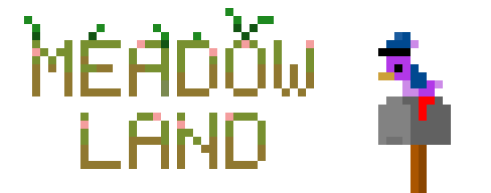



Modding hub for the Desktop Meadow, delivered to you by the SamHub/ResourceHub project.  
Go to the [Special Thanks Page](thanks.md) to see a list of everyone who has contributed to the meadow

## [View Fonts, Resource Packs, And Sprite Packs Here](../Pages/spritepacks.md)

## Welcome to the redesign
hopefully you should be able to find your way around, use the nav. bar on the left hand side of the page

## [Join The Discord Support Server Here](discord.gg/xZFRmPT)

## What can I add to Meadow Land?
Currently you can submit the following to the meadow:
* Spritesheets
* Custom Fonts
* Received letter background

Please view the [Submission Guidelines](../Pages/GUIDELINES.md) before creating a pull request
, If you do not know how to submit a spritepack then you can ask on the [support server](discord.gg/xZFRmPT) and someone will submit it for you

The Creator of the desktop meadow has also kindly asked that you do not decompile the meadow, thanks

## FAQs

Want to know how to make a Resource Pack of your own? Find out how to do that and more on [our FAQ page](FAQ.md)!
